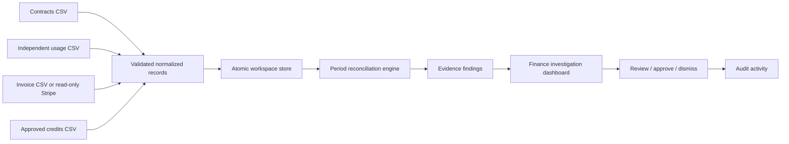

# Architecture and technical decisions

## Scope

RevenueLeak OS v0.1 is a **single-workspace, local or private-hosted SaaS revenue reconciliation pilot**. The business problem is underbilling and lost billable usage. The engineering priority is repeatable math, source traceability and explicit human review rather than an autonomous AI collection agent.

## Data flow

The browser provides the dashboard and upload/review forms, communicating only with same-origin JSON APIs. The Go backend handles authentication, parsing, persistence, Stripe API requests, evidence creation and workflow changes.

### Implementation layers

- `cmd/server`: startup, configuration, listener, first-run synthetic demo data.
- `internal/server`: HTTP API, session, CSRF, export, import, activity logging.
- `internal/core`: data contracts, validation, idempotent upserts, persistent state, reconciliation engine.
- `internal/stripe`: optional read-only Stripe invoice client with mapping and bounded pagination.
- `web`: responsive browser interface without external runtime dependencies.
- `samples`: checked-in CSV templates.

### Reconciliation invariant

- All comparisons are made within a **customer + month + metric + currency** grouping; currencies are **never summed** across currencies.
- A period is eligible only after its last day plus 7 full days (UTC). Current months are never flagged.
- The applicable contract version is the latest effective start month covering the period. Contract validity is monthly, not daily.
- The expected charge is `max(0, usage-included) * unit_rate`, floored by the minimum commitment and reduced by explicit credits.
- A finding is generated **only if expected exceeds finalized billed amount**. Draft and void invoices are disregarded. Negative and foreign-currency invoice lines are skipped at import, and currency mismatches cause the comparison to be skipped.
- Finding IDs are deterministic by customer/month/metric. Existing statuses and notes survive rescans of the same tuple.
- Evidence includes stable source record IDs and numerical inputs used for the comparison. A finding status change cannot modify financial source data.
- Corrections and monetary recoveries happen entirely outside this application. Review does not mean invoicing or collecting.

### Data persistence

Each user action is modeled as a copy-on-write transaction under a process-local mutex. Data is saved as JSON to a `0600` temporary file, synced and atomically renamed into place before becoming the active in-memory snapshot. This supports process restarts, single-instance pilots and prevents partial file content under normal operating conditions. The filesystem must support atomic renames and persistent writable storage.

This approach is **not** multi-process-safe, does not implement a transaction log, cannot support simultaneous pods or efficient history snapshots, and does not replace PostgreSQL for a multi-tenant production service.

### Auth and trust boundaries

A single admin authenticates using a server-side environment password. Successful login creates an expiring signed HttpOnly/SameSite=Strict cookie; state-changing requests require a per-session HMAC-derived CSRF token. `DEMO_MODE=true` with no password is accepted only when binding to `127.0.0.1` or localhost. No browser request contains the Stripe restricted key; the connector reads credentials from server environment variables. The application never uses generative AI for monetary computations.

### Evidence classification

The engine categorizes a positive variance as missing invoice, unbilled usage, minimum shortfall, or price mismatch. Labels are heuristics to prioritize financial investigation and are not proof of which system caused the discrepancy.

## Future production target

In phase 2, replace the single-file store with PostgreSQL tables for organizations, users, memberships, connector configurations, versioned contracts, source records, ingest jobs, reconciliation runs, findings, evidence references and append-only audits. Add a queue for idempotent source ingestion, signed provider webhooks, tenant-based database RLS or strict repository filters, OAuth/KMS-backed credential storage, rate limits, structured tracing and periodic snapshot reconciliation.

See `ROADMAP.md` for the concrete engineering and go-to-market sequence.
